# Senior Connect & Safety+

Secure Android Safety & Communication Application

---

## Overview

Senior Connect & Safety+ is a structured Android application designed to support older adults with:

• Emergency readiness  
• Caregiver communication  
• Medication management  

The application prioritizes accessibility, reliability, and secure local data persistence.  
It is built using modern Android architecture principles and lifecycle-aware components.

---

## Key Features

### Emergency Access
- One-tap 911 calling
- Optional caregiver quick-call
- Minimal navigation depth for urgent use
- Clear, large-button interface

### Trusted Contacts
- Add, edit, delete contacts
- Live RecyclerView updates
- Confirmation dialogs for edits
- Structured local storage

### Caregiver Management
- Multiple caregiver profiles
- SMS and call preference options
- Immediate call access
- Persistent data storage

### Medication Reminders
- Create and manage reminders
- Title, time, and notes fields
- Immediate UI refresh
- Edit and delete functionality

---

## Technical Stack

- Kotlin
- MVVM Architecture
- ViewModel + LiveData
- Room Database
- RecyclerView
- Material Design Components
- Offline-first design

Minimum API: 27  
Recommended API: 30–34  

---

## Architecture Overview

The application follows clean architectural separation:

UI Layer  
↓  
ViewModel  
↓  
Repository  
↓  
Room Database  

This structure ensures:

- Clear separation of concerns  
- Lifecycle safety  
- State preservation  
- Improved testability  
- Reduced memory leaks  

---

## Application Screenshots

### App Icon

  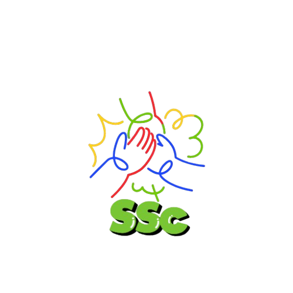

---

### Login Screen

  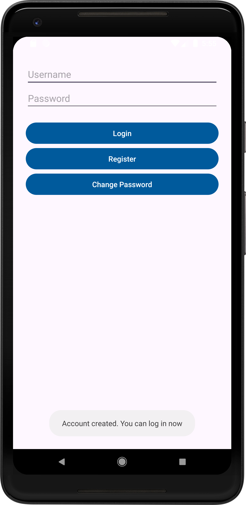

---

### Main Dashboard

  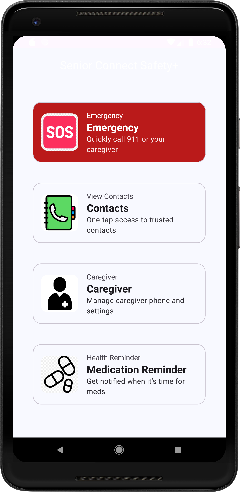

---

### Emergency Module

  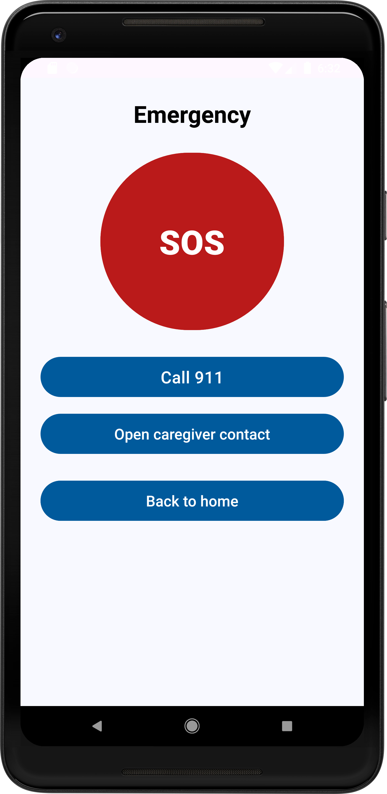

---

### Caregiver Management

  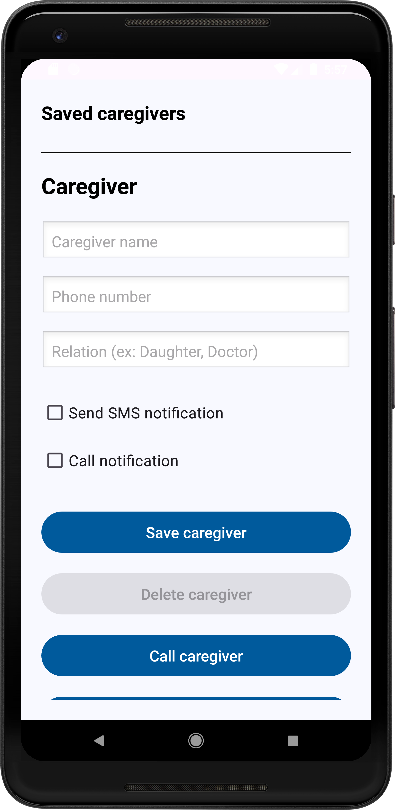
  

---

### Trusted Contacts

  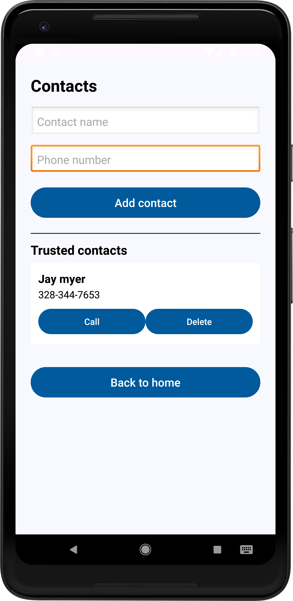
  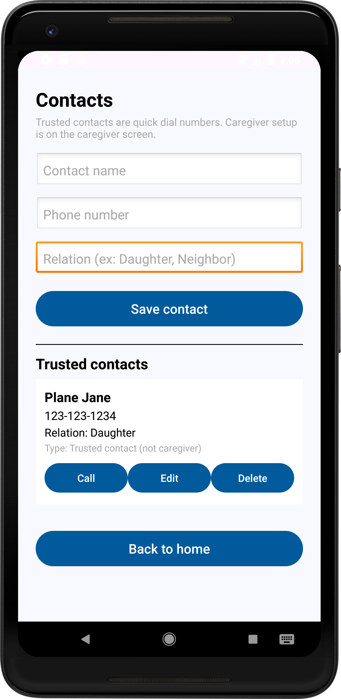
  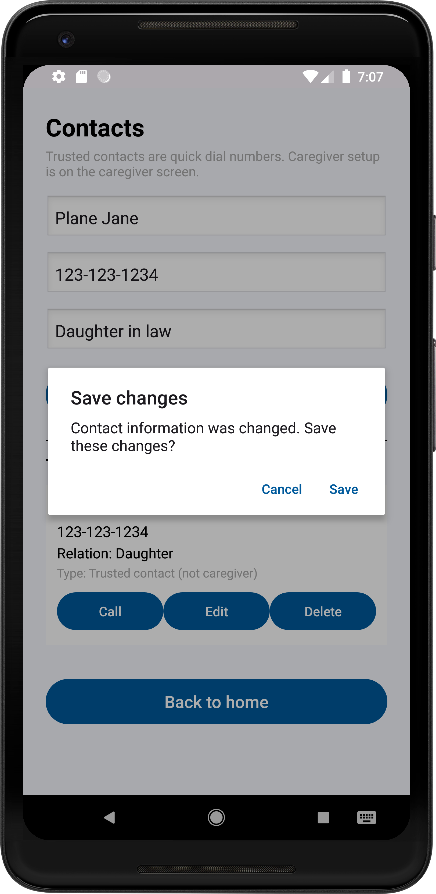

---

### Medication Reminders

  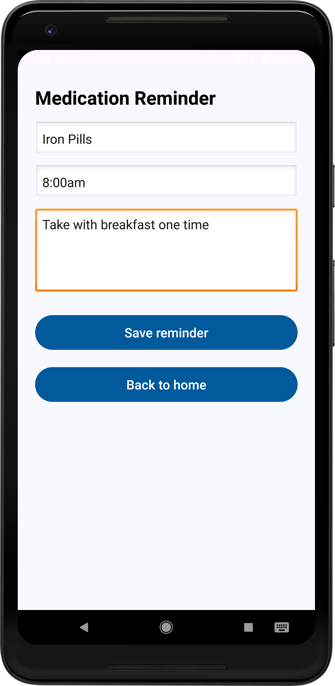
  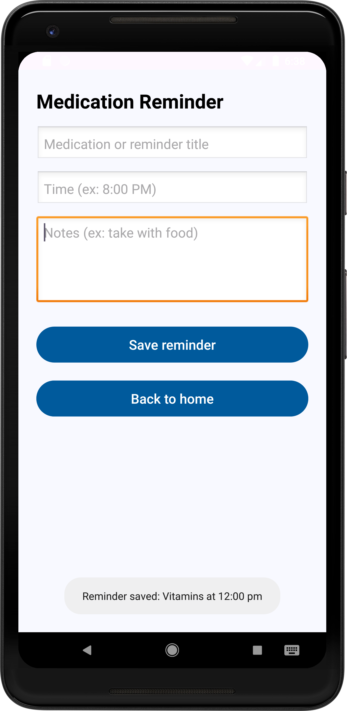
  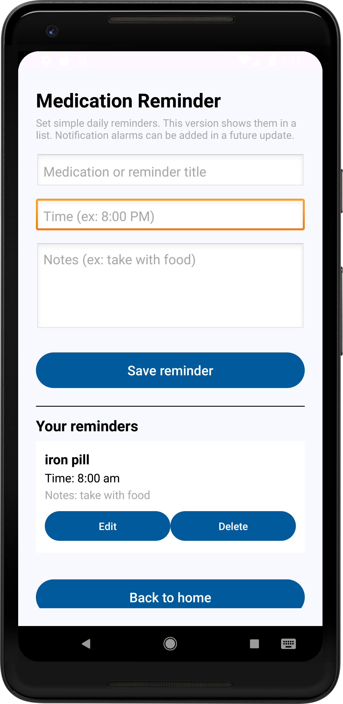

---

## Security & Stability

- Input validation on all forms  
- Confirmation dialogs for destructive actions  
- Structured navigation arguments  
- Offline data persistence  
- Safe handling of configuration changes  
- Lifecycle-aware components  

---

## Demo Video

  

Click the image above to watch the demo.

---

## Build Instructions

1. Open Android Studio  
2. Select “Open Existing Project”  
3. Choose project folder  
4. Allow Gradle sync  
5. Run on emulator/device API 27+  

No external third-party libraries required.

---

## Skills Demonstrated

- Android Application Development  
- Kotlin Programming  
- MVVM Architecture Implementation  
- Room Database Integration  
- RecyclerView Implementation  
- State Management  
- UI/UX Accessibility Design  
- Offline-first Application Design  
- Mobile App Testing  

---

## Project Impact

Senior Connect & Safety+ demonstrates the ability to design and implement a structured Android application using modern architecture patterns.

The project focuses on usability, reliability, and maintainable code structure suitable for real-world deployment scenarios.
